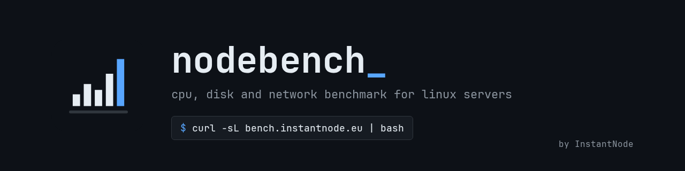
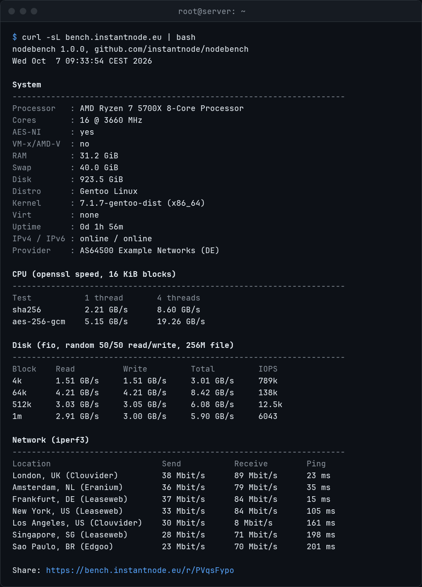
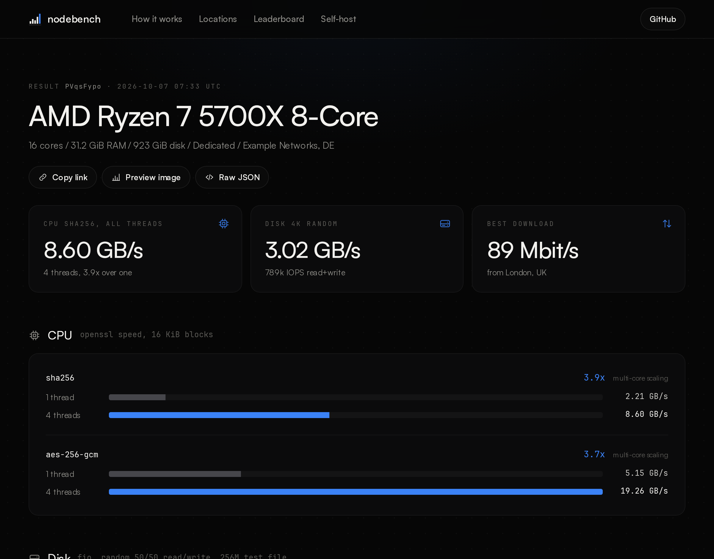
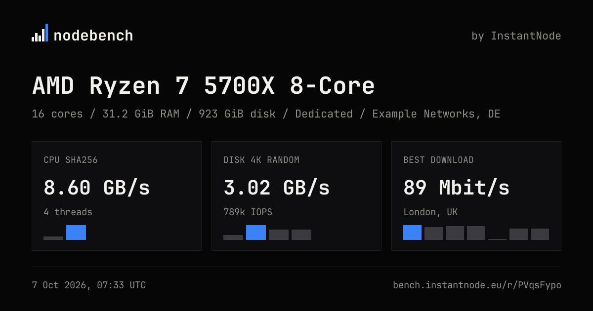

<p align="center"></p>

<p align="center">
  
  
  <a href="https://github.com/instantnodeeu/nodebench/releases"></a>
  <a href="https://github.com/instantnodeeu/nodebench/stargazers"></a>
  <a href="https://github.com/instantnodeeu/nodebench/actions"></a>
  <a href="https://instantnode.eu"></a>
</p>

nodebench is a benchmark script for Linux servers. It tests CPU, disk and network, prints the results in plain tables and gives you a link you can paste into a forum post, a ticket or Discord.

```
curl -sL https://bench.instantnode.eu | bash
```

No root needed and nothing is installed. If fio or iperf3 are missing, static builds are downloaded into a temp directory, checked against their sha256 sums and deleted again when the script exits.

<p align="center"></p>

## What it measures

**System.** CPU model, cores, AES-NI and VM-x flags, virtualization type, RAM, swap, disk size, distro, kernel, uptime, IPv4/IPv6 connectivity and the provider (ASN) the server sits in.

**CPU.** `openssl speed` with sha256 and aes-256-gcm on 16 KiB blocks, once single-threaded and once on all cores. It's not Geekbench, but openssl is on nearly every box, the run takes about 20 seconds and the numbers are easy to compare between machines. During the multi-core run it also records the steal time from `/proc/stat`, which shows how much CPU a busy host takes away from a VPS.

**Disk.** fio random read/write (50/50 mix) with 4k, 64k, 512k and 1m blocks, iodepth 64, two jobs, O_DIRECT. Same parameters as yabs, so results line up with what people already post. If fio can't run at all it falls back to a sequential dd test. The result also notes the filesystem and whether the test file sits on NVMe, an SSD, a spinning disk or a virtual disk.

**Network.** iperf3 in both directions, plus ping and packet loss, against 12 public servers: our own in Eygelshoven (NL), London, Amsterdam, Frankfurt, Paris, New York, Dallas, Los Angeles, Sao Paulo, Singapore, Tokyo and Sydney. `-x` adds Hamburg, Chicago, Miami, Montreal and Hong Kong. Tests run over IPv4 and IPv6 if both work. If iperf3 isn't usable, it measures plain HTTP downloads from Hetzner's speedtest servers instead.

## Options

Pass options after `bash -s --`:

```
curl -sL https://bench.instantnode.eu | bash -s -- -n --no-share
```

| Flag | |
|---|---|
| `-c` | skip the cpu test |
| `-s` | skip the disk test |
| `-n` | skip the network test |
| `-4`, `-6` | network tests over IPv4 or IPv6 only |
| `-d DIR` | directory for the disk test file (default: current dir) |
| `-S SIZE` | size of the disk test file, e.g. `512M` (default: `2G`) |
| `-t N` | threads for the multi-core cpu test (default: all cores) |
| `-l REGIONS` | only test these network regions, comma separated: `eu`, `na`, `sa`, `asia`, `oc` |
| `-x` | test against all 17 locations instead of the standard 12 |
| `-q` | quick run: shorter tests and a 512M disk file, not ranked on the leaderboard |
| `-L [NAME]` | put the result on the [leaderboard](https://bench.instantnode.eu/leaderboard), optionally under NAME |
| `--no-share` | don't upload the result |
| `--json` | only print the result as json, the share link goes to stderr |

The test durations can be shortened with `NODEBENCH_FIO_TIME`, `NODEBENCH_IPERF_TIME` and `NODEBENCH_CPU_TIME` (seconds), which is handy on slow links or when you just want a quick look.

## Leaderboard

Results only go on the public leaderboard if you pass `-L`, optionally with a name (up to 32 characters, no links):

```
curl -sL https://bench.instantnode.eu | bash -s -- -L "fra-edge-01"
```

Without a name the provider name is shown. Only the best run per name, CPU model and network is listed, and results with numbers no real machine produces are kept as links but never ranked.

## Sharing

At the end the result is posted to the share server and you get a link like `https://bench.instantnode.eu/r/PVqsFypo`. The page shows everything from the run, and it comes with an Open Graph image so the link unfurls nicely in Discord, Slack or on X.

<p align="center"></p>

<p align="center"></p>

What gets uploaded is exactly what `--json` prints. Your IP address is not part of it and the server doesn't log it. The provider, ASN and country are shown, the city is not: older versions of the script sent it, the server drops it on upload and when serving old results. Use `--no-share` if you don't want a link at all. Results are public to anyone who has the link.

## Running your own share server

The server is a single Go binary in `server/`. Results are stored as plain JSON files, there's no database.

```
cd server
go build -o nodebench-server .
./nodebench-server -base https://bench.example.com -data /var/lib/nodebench -script ../nodebench.sh
```

Or with Docker:

```
docker build -t nodebench .
docker run -d -p 8080:8080 -v nodebench:/data -e NODEBENCH_BASE=https://bench.example.com nodebench
```

| Flag | Env | Default | |
|---|---|---|---|
| `-listen` | `NODEBENCH_LISTEN` | `:8080` | listen address |
| `-base` | `NODEBENCH_BASE` | `http://localhost:8080` | public url used in share links |
| `-data` | `NODEBENCH_DATA` | `./data` | where results are stored |
| `-script` | `NODEBENCH_SCRIPT` | `../nodebench.sh` | script served to curl and wget on `/` |
| `-proxy` | `NODEBENCH_PROXY` | off | trust `X-Forwarded-For`, only behind a reverse proxy |
| `-rate` | | `20` | uploads per IP per hour |
| `-example` | `NODEBENCH_EXAMPLE` | | result shown with its charts on the home page |
| | `NODEBENCH_ADMIN_TOKEN` | | enables `POST /api/results/<id>/hide` to take a result off the leaderboard |

The leaderboard is kept in memory and rebuilt from the JSON files on start. Hidden results are listed in `hidden.txt` in the data directory.

`/` serves the script itself when the client is curl or wget, everyone else gets a small landing page. A systemd unit is in `deploy/`. Point the script at your server with `NODEBENCH_URL=https://bench.example.com`.

Endpoints:

```
POST /api/results      upload a result, returns {"id": "...", "url": "..."}
GET  /r/<id>           result page
GET  /r/<id>.png       1200x630 preview image
GET  /r/<id>.json      raw result
```

## Credits

The static fio and iperf3 binaries come from the [yabs](https://github.com/masonr/yet-another-bench-script) releases, and the disk test follows its parameters. The iperf3 servers are run by Clouvider, Eranium, Leaseweb and Edgoo. Thanks to all of them for keeping those public.

The share pages use [JetBrains Mono](https://github.com/JetBrains/JetBrainsMono) (OFL, see `server/fonts/OFL.txt`).

## License

MIT, made by [InstantNode](https://instantnode.eu).

The web pages use JetBrains Mono (OFL, see `server/fonts/OFL.txt`) and Inter by Rasmus Andersson (OFL).
